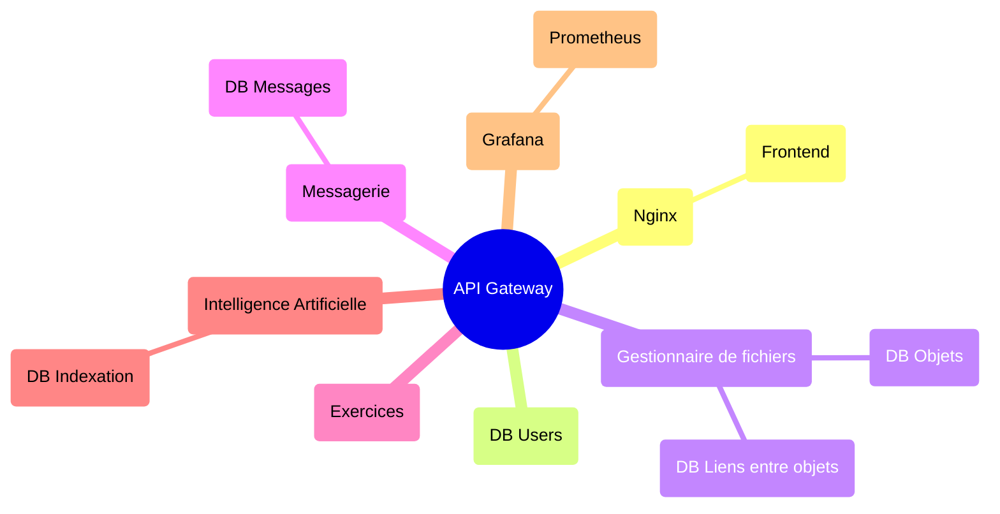
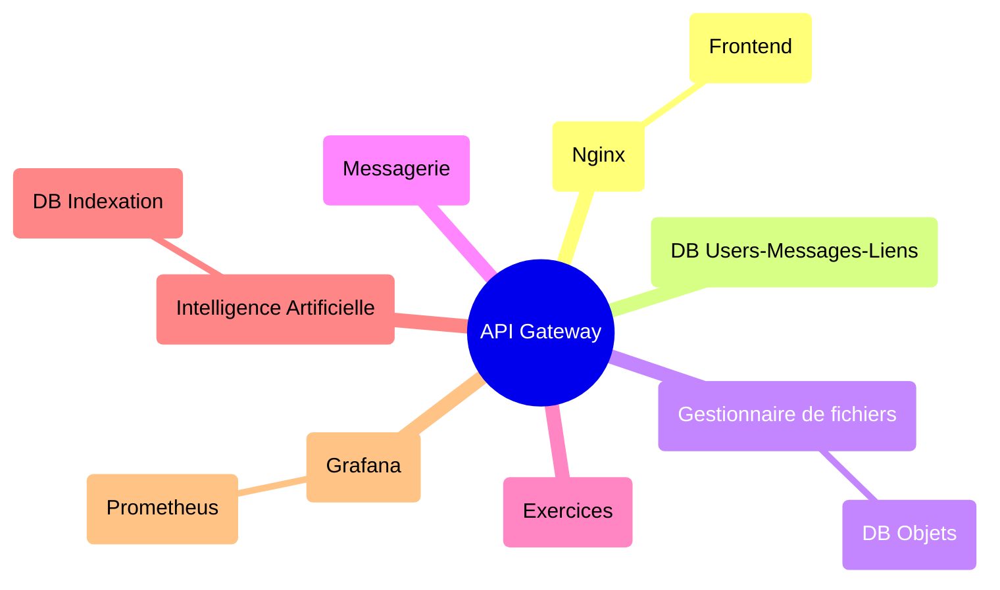

# Transcendence

The project is subdivised in many repositories, and this one's the principal. It regroups all the services for the project.

## How to install

### Requirements

You will need at least :

- `docker` (with docker compose)
- `admin permissions` if you want to modify the `/etc/hosts` file (and use the URL, `https://raiders.io/`, instead of `https://127.0.0.1/`)

### Install the project

To install this project you can use the following commands :

```bash
git clone --recurse-submodules git@github.com:Raiders-io/Transcendence.git
```

Or using `https://` instead of ssh -> `https://github.com/Raiders-io/Transcendence.git`

> /!\ Please don't use the 'Download ZIP button' as it will NOT download the entire project (submodules will be empty). /!\

If you already cloned it and you forgot the `--recurse-submodules`, you can initialize the sub-modules with the following command :

```bash
git submodule update --init --recursive
```

### Update the sub-modules

If you want to use a new version of your sub-module, you can use :

```bash
git submodule update --remote [name]
```

Optional : `name`, update only the given remote.

## Architecture

DB par service



DB rassemblées ?


