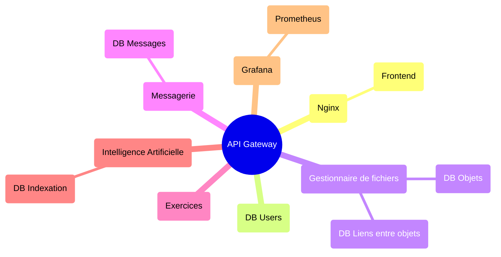
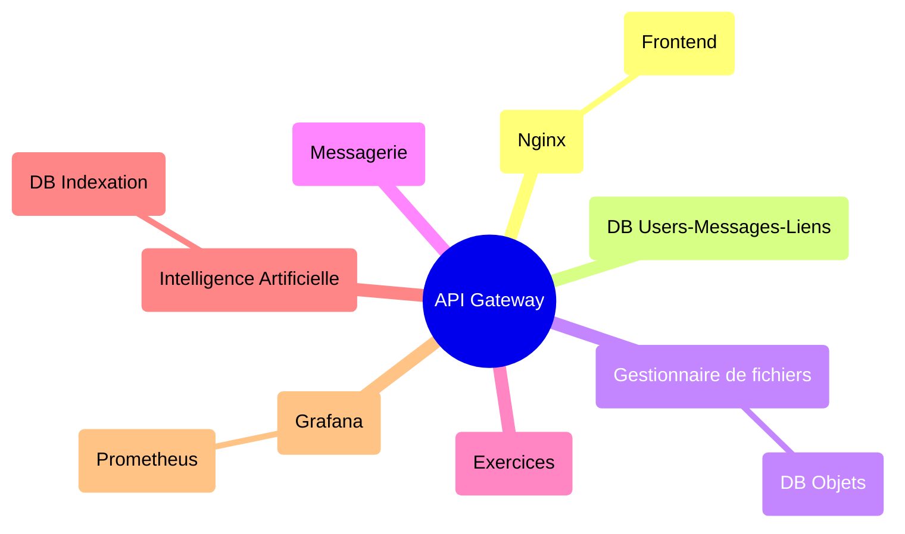

# Architecture

> [!WARNING]
> The graph belows represents an early representation of architecture of the project. It's not updated to the current implementation.

DB par service

DB rassemblées ?

