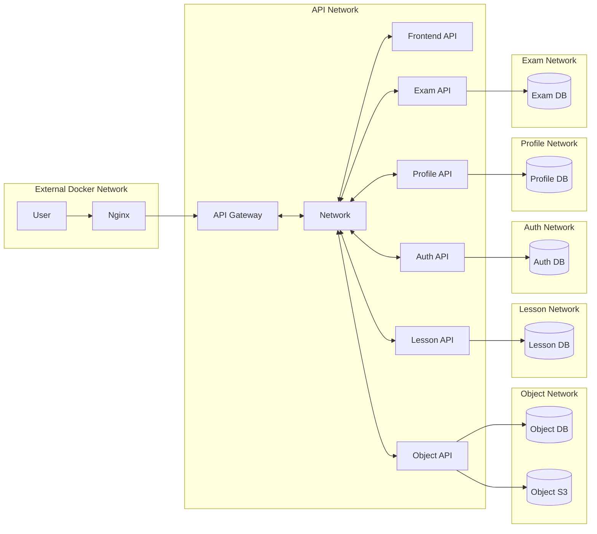

# Architecture

> [!WARNING]
> The graph belows represents the architecture of the project. It may not be updated to the current implementation.

```mermaid
flowchart LR
    subgraph s0["External Docker Network"]
        User["User"]
        Nginx["Nginx"]
    end
    subgraph s1["API Network"]
    direction LR
        GW["API Gateway"]
        Network["Network"]
        API_Frontend["Frontend API"]
        API_Auth["Auth API"]
        API_Obj["Object API"]
        API_Profile["Profile API"]
        API_Lesson["Lesson API"]
        API_Exam["Exam API"]
    end
    subgraph s2["Object Network"]
        DB_Obj[("Object DB")]
        STO_Obj[("Object S3")]
    end
    subgraph s3["Lesson Network"]
        DB_Lesson[("Lesson DB")]
    end
    subgraph s4["Auth Network"]
        DB_Auth[("Auth DB")]
    end
    subgraph s5["Profile Network"]
        DB_Profile[("Profile DB")]
    end
    subgraph s6["Exam Network"]
        DB_Exam[("Exam DB")]
    end

    User --> Nginx
    Nginx --> GW
    GW <--> Network
    Network <--> API_Obj & API_Lesson & API_Auth & API_Profile & API_Exam & API_Frontend
    API_Obj --> DB_Obj & STO_Obj
    API_Lesson --> DB_Lesson
    API_Auth --> DB_Auth
    API_Profile --> DB_Profile
    API_Exam --> DB_Exam
```
